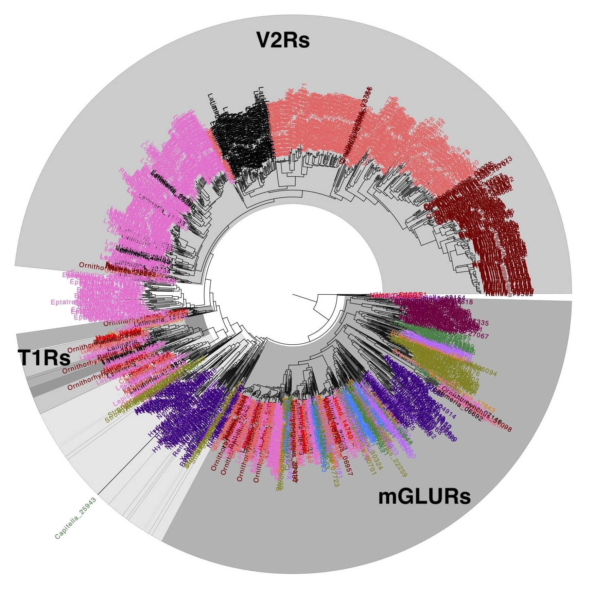
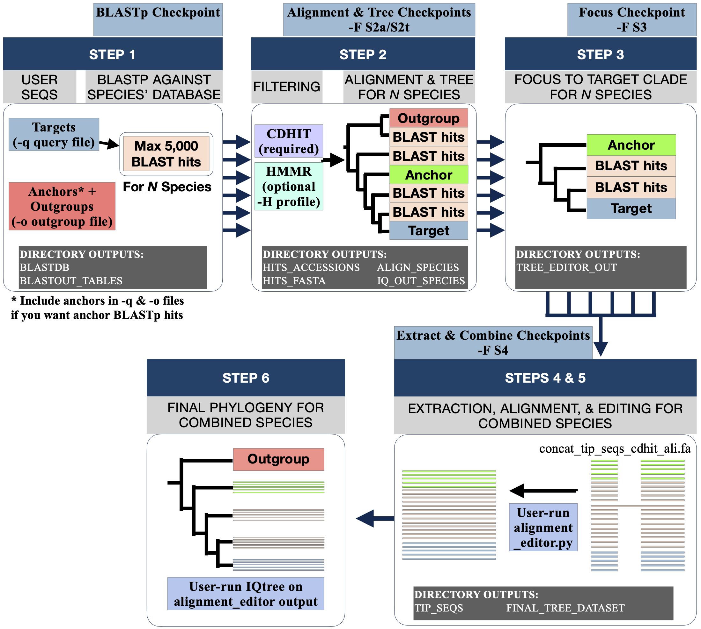
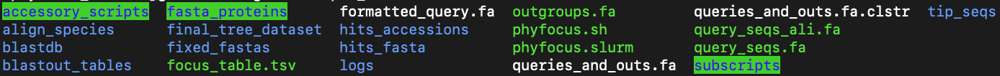
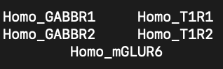

# Phylogenetic_Focusing v2.1.1

Phyfocus assesses the evolutionary history of target gene families, with an emphasis on exhaustively assessing sequence data from a large number of species. This is done by capturing a massive set of potentially-informative sequence data for all species, then using their phylogenetic relationships to extract subtrees focused on the gene families of interest. The focused gene trees for each species are then combined to make large-scale, multi-species gene phylogenies. 

Example Phyfocus run investigating Taste 1 Receptor evolutionary relationships against 45 animal species. Visualized and annotated using FigTree v1.4.4.

### The conceptional basis for Phyfocus
All gene phylogenies are heavily impacted by what sequence data they are given to work with. As no phylogenetic approach can  make use of all the genomic data we have in a single gene tree, criteria must be established for excluding sequence data. In many approaches, this can include manually choosing which sequences go into a phylogenetic pipeline, using species datasets that are not genomic/proteomic, or imposing search algorithm limitations, such as limits on the number of BLAST hits allowed.

The concern with some of these limitations is that they may exclude sequence data not because it is irrelevant, but because it simply did not meet an arbitrary criteria (such as making a BLAST hit count). By making phylogenetic data itself the criteria for excluding sequences through focusing, Phyfocus aims to reduce the potential loss of novel evolutionary relationships while still making assessments of large gene families and many species feasible.

### What Phyfocus is most helpful for:
- Providing a pipeline for rigorous phylogenetics using proteomic data and a large number of species
- Supporting homology identifications for putative sequences
- Assessing the evolutionary relationships of specific genes or gene families
- Enhancing taxonomic and genetic detail of previously published gene phylogenies  
 
### Phyfocus can also assist with projects such as:
 - Assessing gene families that have ambiguous or unknown phylogenetic relationships (limits focusing)
 - Investigating trees for just a few species of interest or from more limited sequence datasets (e.g. not proteomes)

### The PhyFocus pipeline consists of 6 major Steps:
1) Identifying a broad protein dataset for each species using highly permissive BLASTp search
2) Filtering highly similar or uninformative seqs, aligning the data, and making an unfocused gene tree for each species
3) Using user-specified seqs to extract a subtree containing the genes of interest (focusing) for each species
4) Combining the species' focused tree seqs into a single dataset
5) Aligning the combined dataset, user-run inspection & editing with alignment_editor
6) User-run final phylogeny creation

 
# Running PhyFocus

 
<H2> Dependencies & Setup </H2>

### Timeframe, CPU, and RAM
Phyfocus can be time and memory intensive; system parameters we use:
- Multiple threads/CPUs (e.g. 24).
- large amount of available RAM (e.g. 125GB)

For a large phylogeny with 3200 sequences, the program timeframe using the above metrics was thus:
- Step 1 BLASTp datasets: 17h
- Step 2 Per species phylogenies: 148h (~ 6 days)
- Step 3 Extracting sequences: < 1min
- Steps 4-5 and alignment for Step 6: (< 4min)
- Step6 Concatenated Phylogeny:  232h (~ 10 days)
Less CPU & RAM may be feasible, but could incur longer runtimes or errors if RAM depletes.

Note that more reasonably sized runs (say 2000 seqs) can take 4-10 days total; changing certain settings, such as evolutionary model choice, alignment method, and blast hit evalues, can also reduce the duration (See "Running Phyfocus" section for further details). 

### Phyfocus Dependencies:
Programs Phyfocus requires in the user PATH
- AWK
- Python3 (including BioPython package -> Bio.AlignIO module)
- R
- NCBI BLAST+ (specifically makeblastdb and blastp)
- CD-HIT
- MAFFT
- IQTREE
- HMMER (if desired)

### Setup using Conda/Mamba:
- If an Anaconda installation is available, a custom environment containing all needed dependencies can be created using a few conda (or mamba, if installed) commands. Basic instructions are below, but please see Conda/Mamba documentation for the most up-to-date details.
1. Find the "phyfocus_env.yml" YAML file located in Phyfocus' accessory_scripts directory
2. Assuming conda/mamba is already installed, create the phyfocus environment. For example, from the main directory of phyfocus:

        mamba env create -f ./accessory_scripts/phyfocus_env.yml

3. Test if the environment was created properly by activating it, then exporting both the original and a full YAML file to see all dependencies installed (also a handy record for methods citations).
  
        conda activate phyfocus_env
        conda env export --from-history > phyfocus_env.yml
        conda env export > full_phyfocus_env.yml
        conda deactivate

4. NOTE If you are working on a computing cluster managed through a task manager such as SLURM:
- While your own Conda environment may work in your active shell, this may not activate when submitting job requests to nodes through the task manager. In such cases you'll probably need to include shell setup instructions in your job request. An example: 

        source $(conda info --base)/etc/profile.d/conda.sh
        conda activate phyfocus_env

- Any job request submitted should include feedback statements to document that the correct environment is activated and being used. For example:

        echo "Check if CONDA environment activated:"
        env | grep CONDA
        echo  ; echo "Check if environment PATH is properly activated. Active Python is:"
        which python
        echo  ; echo "Pathways for active python packages are:"
        python -m site

- In this, "which python" and "python -m site" are particularly telling. if you do not see paths that denote "phyfocus_env" in them, your job request has not activated the correct environment and is likely running off its default Conda environment, resulting in possible dependency issues or unintended versions being used.  

 <!-- End Dependencies & Setup -->

 
<H2> Testing Installation </H2>

To quickly test if Phyfocus works properly, follow these steps after downloading the phyfocus package.

1. Change your working directory to ./sample_data and ensure the following are present:
    - phyfocus.sh (current version)
    - accessory_scripts/
        - alignment_editor.py
        - download_formats.sh
        - fasta_lengths.py
        - phyfocus.yml
    - subscripts/
        - header_translator.py
        - species_check.sh
        - tree_editor.R
 
2. Enter "./phyfocus.sh -T", which will test the full phyfocus pipeline on sample_data (a class-C GPCR dataset using humans and platypus).

3. Once complete, within sample_data/logs you can examine out_log.txt to observe Phyfocus output and check error_log.txt for any error messages. If Phyfocus ran successfully, the working directory should have the following structure:

In final_tree_dataset, the file "concat_tip_seqs_cdhit_ali.fa" should also contain aligned protein sequences.

 <!-- End Testing Installation -->

 
<H2> Phyfocus Accessory Scripts & Subscripts </H2>

Accessory Scripts are optionally run by the user to improve working with Phyfocus, and located in the accessory_scripts directory. For usage instructions, See the relevant steps in the "Runnning Phyfocus on Your Data" section and/or check the script's help menu by using "script_name -h" while in the accessory_scripts directory.

Subscripts kept in the subscripts directory are required for Phyfocus but not run by the user, and are described here for informational purposes only.

## Accessory Scripts

1. Alignment_editor.py
- The final task of Step 5 in the Phyfocus pipeline. Used to remove sequences in alignments that are causing massive gaps. Assesses this via user specified values for the minmum gap size that is problematic, and the minium percentage of seqs that must have that gap. Detailed usage instructions are in the "Running Phyfocus on Your Data > Executing alignment_editor.py (step 5)" section of this manual.  

2. download_formats.sh
- For convenient file management and tracking, Phyfocus requires the user-provided sequence files for each species database to begin with the species' genus name. Download_formats was made to help make preping these files easier by automating the renaming process. Usage only requires a 2 column CSV file with the following info:

    -f CSV      
        1st is the species' genus  
        2nd is the download link (e.g. FTP) for the peptide dataset.  
    An example line containing both columns:  
    Saccoglossus,https://ftp.ncbi.nlm.nih.gov/genomes/all/GCF/000/003/605/GCF_000003605.2_Skow_1.1/GCF_000003605.2_Skow_1.1_protein.faa.gz

IMPORTANT: if you have more than 1 species from a given genus, you must distinguish the genus column. Example:
Mus fernandoni & Mus musculus --> MusF & MusM

 
3. fasta_lengths.py
 - A simple script that, when given a fasta file via -f, will remove any sequence shorter than the minium length given by the user through -c. This can be helpful in datasets that may contain drastic seq length differences, e.g. after trimming sequence alignments to contain only highly conserved residues. 

4. phyfocus.yml
- A YAML file that is used if you wish to install Phyfocus dependencies via Conda/Mamba environment. See Dependencies & Setup > Setup using Conda/Mamba for usage details.

## Subscripts

#### Tree_Editor.R
Called by phyfocus.sh. Used to extract a focused subtree from the initial phylogeny for each study species (step 3), identified by finding the most recent common ancestor of the user-specified target and anchor sequences. The bait and anchor sequence headers are specified by the user via the TSV fasta headers file. 

#### header_translator.py
Called by phyfocus.sh. Produces a TSV correlating original BLAST sequence headers with the genus_#### headers used by phyfocus for all input sequence data. The TSV is also used automatically to add BLAST hit descriptions as a final column in each BLAST output file.

#### species_check.sh
Called by alignment_editor.py; provides additional data on taxa presence/absence that is appended to the results summary. 

 <!-- End Phyfocus Accessory Scripts & Subscripts -->

 
<H2> Running Phyfocus on Your Data </H2>

The following sections provide detail on user inputs, the 6 major steps of Phyfocus.

 
<H4> User Input Data Setup </H4>

In addition to the Phyfocus package contents noted in "testing Installation" above, ensure your working directory contains the following 4 (5 if HMMR is enabled) user-provided datasets. Note that example user files can be seen in ./sample_data.

1) A query fasta file containing protein sequences (Targets, + Anchors if desired) you wish to use for BLASTp queries (Step 1).
   - Targets are homologs of the specific gene(s) / gene family being studied.
   - Anchors are homologs of gene(s) / gene families closely related to the targets, and together with Targets are used to focus each species' gene tree in Step 3. If BLASTing anchors is not desirable (e.g., doing so pulls massive gene families you do not want), they can be excluded from the query file.
   - All query proteins can come from a single organism, but broader sampling from taxa of interest may improve BLASTp hits.
   - At least 2 sequences must be in this file (more are recommended).

2) A directory of protein FASTA files for each species assessed in the phylogeny (Step 1).
    - Provides the protein databases for each species that BLASTp will search query file seqs against
    - Protein sequences are ideally derived from whole-genome data or thorough transcriptomes.
    - All FASTA file names MUST begin with the species' genus name and an underscore: "genus_" The accessory script "download_formats.sh" can automate this process.

3) An outgroups fasta file containing rooting sequences for all trees (steps 2 & 6), and anchor sequences to enable focusing (step 3).
    - Roots represent 1 or more known outgroups to target AND anchor gene families.
    - There is a minimum of 2 sequences required for roots.

4) A Tab Seperated Values (.tsv) file for phylogeny focusing (Step 3).
    - There should be no column or row headers in the table.
    - Column 1 gives FASTA ">" header names for AT LEAST 2 root proteins from the roots fasta file.
    - Column 2 gives FASTA ">" header names for AT LEAST 1 target and 1 anchor protein from the query fasta file. At least two of each is recommended.
    - Below is the focus.tsv file used in sample_data for a phylogeny of taste receptors within the class-C GPCR family:

        
                 
    - Anchor and root sequences are best chosen by reference to previous phylogenies. The class-C GPCR example was informed by: Fredriksson, R., Lagerström, M. C., Lundin, L. G., & Schiöth, H. B. (2003). The G-protein-coupled receptors in the human genome form five main families. Phylogenetic analysis, paralogon groups, and fingerprints. Molecular pharmacology, 63(6), 1256-1272.

5) (Optional) A FASTA protein alignment including key conserved domains and motifs for HMMR filtering (Step 5).
    - An alignment of the query file can be used.
    - Rigorous alignment (e.g., using MAFFT Linsi) is preferred.
    - Builds the HMMR profile for HMMR filtering to remove any fundamentally different sequences,
      such as proteins lacking a 7TM domain in a GPCR phylogeny.

 <!-- End User Input Data Setup -->

 
<H4> Running phyfocus.sh (steps 1-5) </H4>

The main Phyfocus script automatically runs steps 1-5, with the user manually completing the alignment editing of Step 5 and final phylogeny construction in Step 6. 
The following parameters info is also available in the phyfocus help menu (./phyfocus.sh -h)

--------------------------------------------------------------------------------------------------------------------------------
Program syntax: 
[-h] [-q ./file] [-o ./file] [-f ./directory/] [-c ./file] [-H ./file] [-t num] [-e value] [-a string] [-A string] [-m string] [-b num] [-s num] [-F string] [-T] [-X]

-h <help>   Display this help and exit

#### REQUIRED ITEMS
-q QUERY Fasta file containing peptides for BLASTp query that represent your targets of interest. Anchors may also be included  
-o OUT      Fasta file containing outgroup (anchor and rooting) peptides  
-f FASTAS   Directory of peptide fasta files for each species in the desired phylogeny  
-c CLADE    A .tsv file of fasta header names for root and target+anchor sequences  

#### OPTIONAL RUN PARAMETERS
-H HMMER    Peptide fasta alignment for making the HMMER profile  
-t THREADS  Number of threads used for BLAST & IQtree. Default = 24  
-e EVALUE   E-value significance cutoff used in BLAST. Default = 0.05  

#### OPTIONAL ALIGNMENT & TREE PARAMETERS
-a ALIGN1    MAFFT method for Step2 unfocused species alignments. Default is "linsi" but the fast progressive method FFT-NS-2 (enter "mafft --retree 2 --maxiterate 0") can be used for testing. Include the quotes. See the MAFFT website for additional options.  

-A ALIGN2    MAFFT method for Step4 combined species alignment. Default and alternatives same as for -a ALIGN1  
-m MODEL    Peptide substitution model used by IQTree. Recommend LG for quick testing. Default = MFP+C60  
-b BOOT     Number of Ultrafast Bootstrap replicates used by IQTree. Minimum value = 1000. Ignore for quick testing.  
-s SHALRT   Number of SH-aLRT Bootstrap replicates used by IQTree. Minimum value is 1000. Ignore for quick testing.  

#### ADDITIONAL OPTIONS
-F FORCE    Forces phyfocus to rerun at one of the following checkpoints.  

    S2a = Step 2 (alignments), remake per-species alignments  
    S2t = Step 2 (trees), remake per-species unfocused trees  
    S3  = Step 3 (focusing), remake per-species focused trees  
    S4  = Step 4 (extract and combine), remake combined dataset for final tree      
Note: -F reruns delete all pre-existing output that comes after the chosen checkpoint, then runs phyfocus as normal. 
 
-T TEST     Run while in ./sample_data to test dependencies and demo the program  
-X CLEAN    Removes all phyfocus output files in the current working directory.  

-------------------------------------------------------------------------------------------------------------------------------
A basic executing command using all default settings could be thus:  

    ./phyfocus.sh -q ./query_file.fa -f fasta_proteins/ -r roots_file.fa -H hmmr_ali.fa -c focus_table.tsv

 <!-- End Running phyfocus.sh (steps 1-5) -->

 
<H4> Understanding Phyfocus-Generated Outputs </H4>

Phyfocus will generate a number of directories and files. The below clarifies the directory outputs made by each step in chronological order.    

Before Step 1: logs directory stores the following output records:  
- out_log.txt = the main log for phyfocus and dependecy program statements
- summary_log.txt = A more user-friendly out_log that excludes dependency output and notes major Phyfocus step outputs and elapsed time statements.
- error_log.txt = error reports from many phyfocus or dependency issues
- header_translation_table.tsv = a lookup table that correlates original sequence header info with the numerical headers used by Phyfocus 
- HMMR_removed_seqs_info.txt = A header list of all seqs removed by HMMR filtering, if used
- focus_removed_seqs.txt = A header list of all seqs removed by focusing for each species
- focusing_trees.pdf = PDF of visualized unfocused and focused trees for each species

Step 1) Identifying protein datasets per species  
A. fixed_fastas directory
- Edits all fasta files in the user-provided directory to remove uneccessary line feeds and convert all sequence headers to "genus_number" format.

B. blastdb & blastout_tables directories
- Storage location for the BLAST databases and BLAST result tables, respectively. As BLAST hit headers will all be in "genus_number" format, each table also includes the hit's original sequence header for easier identification.  

Step 2) Filtering, alignment, & unfocused phylogeny per species  
A. hits_accessions & hits_fasta directories
- stores the sequence headers for BLAST hits and the FASTA sequences obtained with those headers, respectively.
- hits_fasta stores not only the original BLAST hit fasta sequences, but also what sequences remain after CDHIT and (if used) HMMR filtering. Sequences removed by HMMR are reported in the "HMMR_removed_seqs_info.txt" log file.

B. align_species directory
- Stores the sequence alignments made from each species' filtered BLAST hits.
- also contains B2, B3, and B4 directories    

B2. IQ_out_extra_files directory
- IQtree's other files, including log, consensus tree, etc.  

B3. IQ_out_species directory
- The maximum likelihood gene phylogeny made from each species' alignment file

Step 3) Extracting focused phylogeny per species  
B4. tree_editor_out directory
- Stored in IQ_out_species, contains the focused maximum likelihood gene phylogeny for each species

Step 4) Concatenating per species focused datasets  
A. tip_seqs directory
- Contains the extracted fasta sequences present in each species' focused phylogeny
B. final_tree_dataset directory
- Directory where all tip_seq files are combined into a final focused dataset. This is generally where alignment_editor is run by the user and the final IQtree run is conducted.  
 
Step 5) Concatenated alignment, inspection & editing  
Step 6) Generating final focused phylogeny
- Phyfocus will create "concat_tip_seqs_cdhit_ali.fa" in the final_tree_dataset directory. Running alignment_editor.py and then IQtree here will generate their respective outputs. Otherwise, No new directories are made in steps 5 or 6. 

 <!-- End Understanding Phyfocus-Generated Outputs -->

 
<H4> Monitering output Data </H4>

Because Phyfocus can take days, assessing if the per-species blast (Step 1) is capturing too narrow or too broad a dataset for your phylogenies can save significant time. Two approaches can help here:  

1. Examine the BLAST output files at ./blastout_tables. These have been edited to include the original header descriptions, allowing you to see what sequences given blast queries and the e-value cutoff are obtaining. A potential issue to look for here is if many gene family members from far outside your rooting seqs' gene family are being obtained. 

2. Once they are generated the unfocused (Step 2) and focused (Step 3) species trees can also be examined in detail by looking at ./align_species/IQ_out_species and ./align_species/IQ_out/tree_editor_out, respectively, or in quick summary by looking at focusing_trees.pdf in the logs directory. While the trees can be annotated to observe the focusing impact and tree quality, a quicker look referencing just the named target, anchor, and root sequences can give an idea if proper monophyletic clades are being reconstructed.
- NOTE: when examining the unfocused and focused trees in focusing_trees.pdf, R may draw a monophyletic clade used for rooting as a polytomy. Programtically it does not appear to treat the clade as such, and thus shouldn't affect the focusing step.

If the blast outputs and/or per-species trees indicate an issue with the dataset you may need to rerun the data using BLAST evalues different from the default of 0.05. 
- For example, if too many genes outside your rooting seqs are bloating the alignments and subsequent trees, consider a more stringent evalue such as 1e-05 (check the blast output files to get a sense of what cutoff may help).
- If you were BLASTing both queries and anchors, you may want to consider only subjecting queries to BLAST.

 <!-- End Monitering output Data -->

 
<H4> Executing alignment_editor.py (step 5) </H4>

Once complete, ./phyfocus.sh produces an alignment that is the starting point of Step 6 (see "final_tree_dataset/final_tree_seqs_ali.fa"). It will also move alignment_editor.py to this directory for user convenience.

concat_tip_seqs_cdhit_ali.fa may contain massive gaps (100s+ in length) due to a small subset of sequences. To improve alignment quality, Alignment Editor removes these gap-causing sequences according to user-specified gap length and gap frequency cutoffs. Current recommendation is to manually inspect the concatenated alignment to identify an approximate size of massive gaps, then run alignment_editor.py. 

Usage syntax and options for alignment_editor are also available under the help menu (./alignment_editor.py -h)

-------------------------------------------------------------------------------------------------------------------------------
Program syntax: 
./alignment_editor.py  ./final_tree_seqs_ali.fa [-h] [-w num] [-g num] 

-h <help>   Display help and exit

-w <window> Specify the minimum gap length that is disruptive to the alignment. Default is 50bp, but an effective
benchmark appears to be 4% of the alignment's total length. Manual assessment of the alignment
is strongly recommended.

-g <gappercent> Specify the minimum percent of seqs that must contain -w size gaps to identify problematic seqs.
Default is 0.9.

-------------------------------------------------------------------------------------------------------------------------------
Upon completing alignment_editor.py, running IQtree will complete Step 6 and produce the final focused phylogeny. Recommended command:

    iqtree -s <alignment_editor_output_file.fa> -m MFP+C60 -alrt 1000 -bb 1000 -nt 24

 <!-- End Executing alignment_editor.py (step 5) -->

 <!-- End Running Phyfocus on Your Data -->

 
<H2> Managing Errors & Reruns </H2>

Phyfocus (and programs it uses like IQtree) are designed to cancel the run if certain errors or issues occur. The out_log.txt file will indicate the last steps taken, while specific error messages are recorded in error_log.txt.
Once the error has been dealt with, phyfocus.sh can be restarted at the last valid step by re-running the same command originally used, provided the contents of its working directory have not been changed by the user. The restarted run date and all steps skipped are always appended to the out_log.txt file before standard output logging resumes.

The following represent some errors you may encounter in error_log.txt, along with recommended solutions:

#### Permissions denied. 
- Upon downloading the phyfocus directory, included scripts may not be executable due to permissions. In this case, run the following commands while in the phyfocus directory to make all files executable:

    chmod 777 ./*  
    chmod 777 ./accessory_scripts/*  
    chmod 777 ./subscripts/*

#### Numerical underflow (lh-branch). Run again with the safe likelihood kernel via `-safe` option
- An error from IQtree during Step 2 that requires IQtree's "-safe" option. This special run should be done manually on the specific species' dataset concerned (see out_log.txt for the last species' dataset being used). 
- It is crucial to ensure this is done in the ./align_species directory, and using the same IQtree parameters originally specified by the user or the default phyfocus settings.
- An example solution starting from the working directory:

    cd ./align_species  
    iqtree -safe -s Homo_protein.faa_FIX_hits.fa_ali.fa -m MFP+C60 -alrt 1000 -bb 1000-nt 24 2>> ../logs/error_log.txt | tee -a ../logs/out_log.txt
    
- Once complete, phyfocus.sh can be restarted as normal using the original input commands.

#### Warning: unable to access index for repository http://cran.us.r-project.org/src/contrib: cannot open URL 'http://cran.us.r-project.org/src/contrib/PACKAGES'
- Step 3 Focusing requires several R packages available from the CRAN library, which the subscript Tree_Editor.R will download automatically if they are not detected. 
- If you are running phyfocus via a shell that does not have internet access (e.g., some nodes in computing cluster task managers), its possible that phyfocus will error out when it tries to install missing packages.
- In this case, needed R packages must be installed manually. Activate the environment you use to run phyfocus, then enter the following commands:
> Rscript install.packages("ape", dependencies = TRUE, repos = "http://cran.us.r-project.org")
> Rscript install.packages("phytools", dependencies = TRUE, repos = "http://cran.us.r-project.org")
> Rscript install.packages("stringi", dependencies = TRUE, repos = "http://cran.us.r-project.org")
 
#### Error in while (!done) { : missing value where TRUE/FALSE needed
- This is a focusing error from the findMRCA function in R's phytools package.
- findMRCA is used twice with the user provided focusing TSV file: first to root the unfocused phylogeny using the TSV's first column, then to extract the focused clade using the targets & anchors provided in column 2. 
- This error occurs when sequences specified in the TSV are not found in the phylogeny. This can be due to a typo in the TSV, or accidentally not including the matching sequence header in the query or outgroup files

 <!-- End Managing Errors & Reruns -->

# Assessing Phyfocus Phylogenies

 
<H2> Fixing Target, Anchor, & Root Sequence Names in Your Tree </H2>

Once the combined dataset is made in Step 4 and run through CDHIT (./final_tree_dataset/concat_tip_seqs_cdhit.fa), it is likely the header names you originally provided for all target, anchor, and root sequences may have been replaced with phyfocus numerical headers. If the original header names for these known seqs are desired for tree annotations, Consider the following:  

1. Identify which query/root seqs have had their headers changed. Use grep's -B and -A arguments to see which CDHIT cluster every user sequence belongs to (you may have to increase this number depending on how many seqs are in a given cluster).

        grep -f ./queries_and_outs.fa ./final_tree_dataset/concat_tip_seqs_cdhit.fa.clstr -B 3 -A 3

- Changed entries in this CD-HIT output will state a 100% match. In the example below, Homo_Melanopsin was replaced with the numerical header Homo_94301 (denoted by the '*'):         
> \>Cluster 248  
> 0    478aa, >Homo_94301... *  
> 1    478aa, >Homo_Melanopsin... at 100.00%  

2. Change any numerical headers in "concat_tip_seqs_cdhit_ali.fa" that replaced the desired query/root headers. (Using find/replace via a word processor is a simple approach.) Note that you can fix these headers at any time; however, fixing them before using alignment_editor and making any final Step 6 phylogenies ensures you only have to correct it once. 

 <!-- End Fixing Target, Anchor, & Root Sequence Names in Your Tree -->

 
<H2> Viewing & Annotating Phylogenies </H2>

The Newick formatted data in the step 6 .treefile can be copied into a viewer like FigTree for rooting with the root sequences clade and annotating features of interest. 
(Rambaut, A. (2018) FigTree v1. 4.4: a graphical viewer of phylogenetic trees. Available from http://tree.bio.ed.ac.uk/software/figtree/.)      

Phyfocus phylogenies will have all tree tips labeled using the "genus_####" numerical header nomenclature. For identifying sequences/clades, the numerical headers can be copied into a .txt file in the main working directory and looked up via the "header_translation_table" TSV:

    grep -f headers.txt header_translation_table.tsv

The results will correlate the given numerical headers with their originally provided FASTA headers. For example:
> \>Acanthaster_17320    >XP_022096382.1 pinopsin-like [Acanthaster planci]  
> \>Acanthaster_17794    >XP_022096856.1 rhodopsin-like [Acanthaster planci]  
> \>Acanthaster_20160    >XP_022099222.1 pinopsin-like [Acanthaster planci]  
> \>Acanthaster_20161    >XP_022099223.1 rhodopsin-like [Acanthaster planci]  
 
 Gene family clades, etc. can then be annotated on the tree in the chosen tree viewing program.
 
## Visualizing Node Support
The Ultrafast bootstrap and SH-aLRT node values provided by IQtree indicate which nodes are confidentally supported; IQtree recommends a benchmark of UFboot >= 95% and SH-aLRT >= 80% (http://www.iqtree.org/doc/Frequently-Asked-Questions). To collapse unsupported nodes into a polytomy, the following protocol may be used:

1. Extract node values via Tree Graph 2 (<http://treegraph.bioinfweb.info/>)
    - Run GUI via .jar file. 
    - open .treefile
    - export node data as table
        - use "unique node names" and "bootstrap/SH-aLRT" labels columns (in that order)
        - export all nodes with column headers
    - Do not close the .treefile window after exporting

2. Change UFboot/SH-aLRT values to 1 value per column
- Open exported .txt in excel/numbers as TSV
- Change the label column header to "UF-Boot" and add a new column: "SH-aLRT"
- Export table as CSV
- Open CSV in a text editor, use find+replace to change all "/" to ","
- Open CSV in excel/numbers again, delete the empty column at right.

3. Collapse Phylogeny based on node support
- import CSV into the open Tree Graph 2 window via "import table as node/branch data" (all files format, no skipped lines, first line contains headers. Be sure to check values separated by ",")
- "select matching key columns" step correlates same data in the table and tree. Use unique node names column for both.
- Set node data type for UFboot and SH-aLRT as "new hidden branch data with specified ID." 
- Use "Collapse Nodes by Support" option twice: UFBoot at 95, and SH-aLRT at 80. 
- Export result as a nexus file, the collapsed tree can now be viewed or edited in Figtree, etc. as before.

 <!-- End Viewing & Annotating Phylogenies -->
